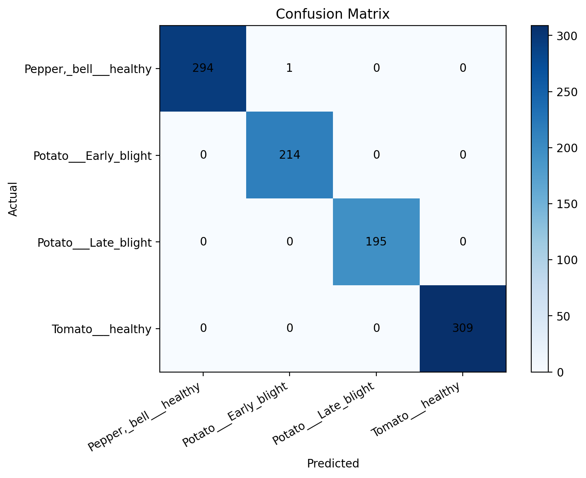
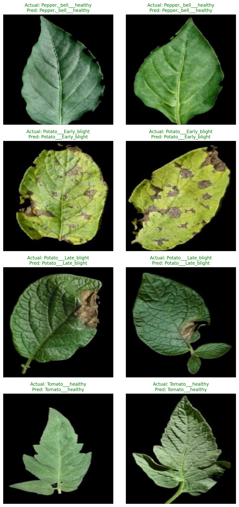

# Bitki Hastalığı Sınıflandırma

Bu proje, yaprak görsellerinden bitki hastalığı sınıflandırması yapmak için hazırlanmış bir görüntü işleme ve derin öğrenme projesidir. PyTorch kullanılarak geliştirilmiştir ve GitHub portföyü için uygun, düzenli ve genişletilebilir bir yapı sunar.

## Proje Amacı

Amaç, bir yaprak fotoğrafını alıp hangi sınıfa ait olduğunu tahmin eden bir model eğitmektir.

Örnek kullanım senaryoları:
- Sağlıklı ve hastalıklı yaprakları ayırt etmek
- Transfer learning yaklaşımını kullanmak
- Daha sonra Streamlit veya Gradio ile demo hazırlamak

## Kullanılan Teknolojiler

- Python 3.10+
- PyTorch
- Torchvision
- Pillow
- PyYAML
- Matplotlib

## Proje Yapısı

```text
.
|-- configs/
|   |-- train.yaml
|   `-- train_colab.yaml
|-- data/
|   |-- raw/
|   `-- processed/
|-- notebooks/
|   |-- exploration.ipynb
|   `-- train_on_colab.ipynb
|-- outputs/
|-- src/
|   |-- __init__.py
|   |-- data.py
|   |-- evaluate.py
|   |-- infer.py
|   |-- model.py
|   |-- train.py
|   |-- utils.py
|   `-- visualize_results.py
|-- .gitignore
|-- requirements.txt
`-- README.md
```

## Seçilen Veri Seti

Bu projenin ilk sürümü için `PlantVillage` veri seti seçildi.

Neden bu veri seti:
- Bitki hastalığı sınıflandırmada yaygın olarak kullanılır
- ResNet18 gibi modeller için uygundur
- `torchvision.datasets.ImageFolder` yapısına doğrudan uyar
- Portföy projesi olarak anlatması ve göstermesi kolaydır

Kaynaklar:
- PlantVillage GitHub veri seti: https://github.com/spMohanty/PlantVillage-Dataset
- Makale: https://doi.org/10.3389/fpls.2016.01419

Pratik tercih:
- `raw/color` klasörü kullanıldı
- İlk sürümde tüm sınıflar yerine 4 sınıf seçildi

Kullanılan sınıflar:
- `Pepper,_bell___healthy`
- `Potato___Early_blight`
- `Potato___Late_blight`
- `Tomato___healthy`

## Veri Klasörü Yapısı

Veri şu şekilde yerleştirilmelidir:

```text
data/raw/train/
|-- Pepper,_bell___healthy/
|-- Potato___Early_blight/
|-- Potato___Late_blight/
`-- Tomato___healthy/
```

İstersen ayrı `val/` veya `test/` klasörleri de kullanabilirsin. Ancak bu projede yalnızca `train/` klasörü kullanıldı ve validation verisi eğitim sırasında ayrıldı.

## Kurulum

```bash
python -m venv .venv
.venv\Scripts\activate
pip install -r requirements.txt
```

## Eğitim

Yerelde eğitim:

```bash
python -m src.train --config configs/train.yaml
```

## Google Colab ile Eğitim

Yerel CPU eğitimi yavaş olduğu için proje Colab GPU ile de eğitilecek şekilde hazırlandı.

Kullanılan dosyalar:
- Notebook: `notebooks/train_on_colab.ipynb`
- Colab config: `configs/train_colab.yaml`

Önerilen akış:
1. Tüm proje klasörünü Google Drive'a yükle
2. Veri setini `data/raw/train/` altında tut
3. `train_on_colab.ipynb` dosyasını Colab'da aç
4. GPU runtime seç
5. Hücreleri sırasıyla çalıştır

Varsayılan Colab ayarları:
- Epoch: `15`
- Batch size: `32`
- Kaydedilen model: `outputs/best_model_colab.pt`

## Eğitim Sonuçları

### Yerel CPU Sonucu

En iyi validation accuracy:

```text
0.9911
```

Epoch özeti:

```text
Epoch 1 | train_acc: 0.9381 | val_acc: 0.7789
Epoch 2 | train_acc: 0.9647 | val_acc: 0.9033
Epoch 3 | train_acc: 0.9763 | val_acc: 0.9911
Epoch 4 | train_acc: 0.9810 | val_acc: 0.8815
Epoch 5 | train_acc: 0.9751 | val_acc: 0.9832
```

Oluşan çıktılar:
- `outputs/best_model.pt`
- `outputs/training_history.json`

### Google Colab T4 GPU Sonucu

Model, Google Colab üzerinde T4 GPU kullanılarak `configs/train_colab.yaml` ile tekrar eğitildi.

En iyi validation accuracy:

```text
0.9990
```

Epoch özeti:

```text
Epoch 1  | train_acc: 0.9635 | val_acc: 0.9625
Epoch 2  | train_acc: 0.9763 | val_acc: 0.8657
Epoch 3  | train_acc: 0.9682 | val_acc: 0.8154
Epoch 4  | train_acc: 0.9896 | val_acc: 0.9951
Epoch 5  | train_acc: 0.9906 | val_acc: 0.9477
Epoch 6  | train_acc: 0.9813 | val_acc: 0.9408
Epoch 7  | train_acc: 0.9847 | val_acc: 0.9526
Epoch 8  | train_acc: 0.9879 | val_acc: 0.9605
Epoch 9  | train_acc: 0.9953 | val_acc: 0.9882
Epoch 10 | train_acc: 0.9904 | val_acc: 0.9842
Epoch 11 | train_acc: 0.9901 | val_acc: 0.9970
Epoch 12 | train_acc: 0.9914 | val_acc: 0.9911
Epoch 13 | train_acc: 0.9958 | val_acc: 0.8184
Epoch 14 | train_acc: 0.9938 | val_acc: 0.9161
Epoch 15 | train_acc: 0.9946 | val_acc: 0.9990
```

Oluşan çıktı:
- `outputs/best_model_colab.pt`

## Validation Özeti

`outputs/best_model_colab.pt` modeli için üretilen validation sonuçları:

- Genel doğruluk: `0.9990`
- Validation örnek sayısı: `1013`
- `Pepper,_bell___healthy`: `0.9966`
- `Potato___Early_blight`: `1.0000`
- `Potato___Late_blight`: `1.0000`
- `Tomato___healthy`: `1.0000`

Confusion matrix:



Örnek tahminler:



## Tahmin Alma

Tek bir gorsel uzerinde tahmin yapmak icin:

```bash
python -m src.infer --image path/to/image.jpg --checkpoint outputs/best_model_colab.pt
```

## Degerlendirme

Validation metriklerini ve confusion matrix tablosunu uretmek icin:

```bash
python -m src.evaluate --config configs/train.yaml --checkpoint outputs/best_model_colab.pt
```

Bu komut su dosyalari olusturur:
- `outputs/evaluation_summary.json`
- `outputs/confusion_matrix.csv`

Gorsel ciktilari uretmek icin:

```bash
python -m src.visualize_results --config configs/train.yaml --checkpoint outputs/best_model_colab.pt
```

Bu komut su dosyalari olusturur:
- `outputs/confusion_matrix.png`
- `outputs/sample_predictions.png`

## Bu Proje Neden GitHub Icin Iyi

- Temiz ve duzenli klasor yapisi var
- Config tabanli egitim akisi sunuyor
- Transfer learning kullaniyor
- Inference, evaluation ve gorsellestirme scriptleri var
- Colab GPU egitimi destekliyor
- Somut sonuclar ve gorseller iceriyor

## Repo Notlari

- Veri seti dosyalari git'e eklenmemistir
- Model agirlik dosyalari git'e eklenmemistir
- Portfoy sunumu icin gorsel sonuc dosyalari repo icinde tutulmustur

## Gelistirme Fikirleri

1. Ayrı bir test seti ile daha guclu degerlendirme yapmak
2. Daha fazla sinif ile ikinci surum hazirlamak
3. Farkli backbone modelleri karsilastirmak
4. Streamlit veya Gradio arayuzu eklemek
5. Deploy edilmis canli demo hazirlamak
